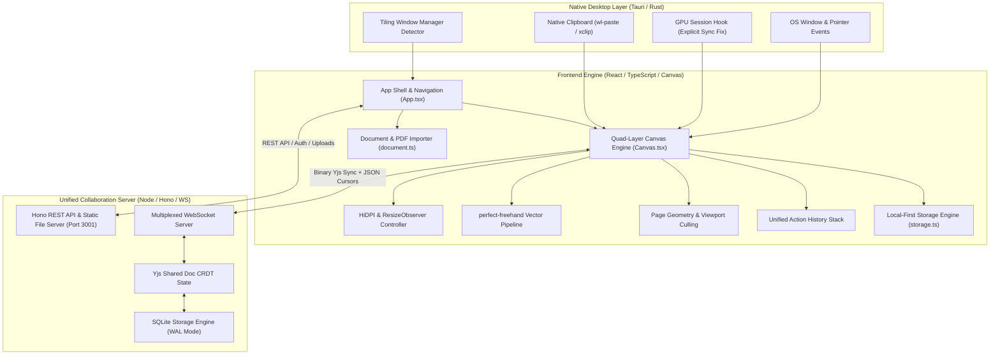
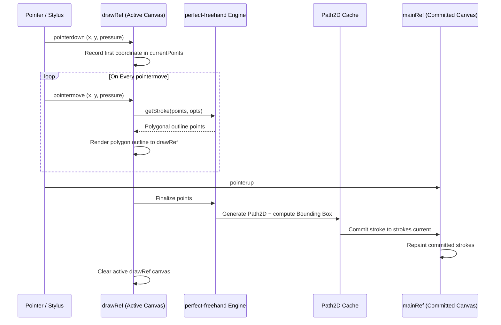
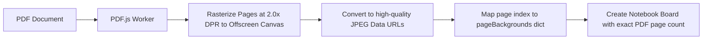
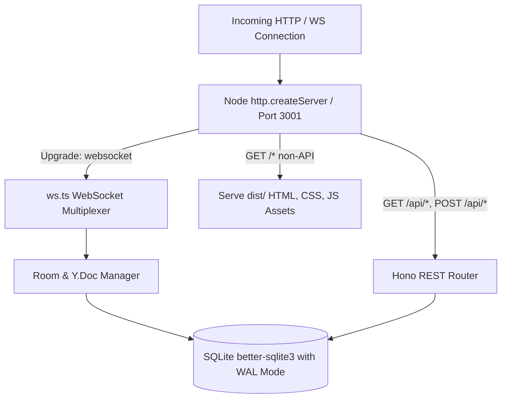
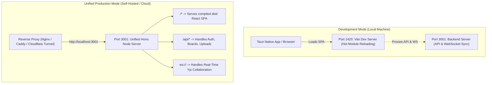

# Whiteboard — System Architecture & Implementation Manual

Comprehensive architectural documentation, technical specification, and subsystem reference for the **Whiteboard** project.

---

## Table of Contents

1. [Architectural Overview & System Philosophy](#1-architectural-overview--system-philosophy)
2. [High-Level System Topology](#2-high-level-system-topology)
3. [Native Layer: Tauri v2 & Rust (`src-tauri/`)](#3-native-layer-tauri-v2--rust-src-tauri)
   - [3.1 GPU Acceleration & Wayland Explicit Sync Pipeline](#31-gpu-acceleration--wayland-explicit-sync-pipeline)
   - [3.2 Tiling Window Manager Detection & Frame Decoration](#32-tiling-window-manager-detection--frame-decoration)
   - [3.3 Native OS Clipboard Image Pipeline](#33-native-os-clipboard-image-pipeline)
   - [3.4 Tauri Capability & Security ACLs](#34-tauri-capability--security-acls)
4. [Rendering & Canvas Engine (`src/components/Canvas.tsx`)](#4-rendering--canvas-engine-srccomponentscanvastsx)
   - [4.1 Multi-Layer Canvas Stack Architecture](#41-multi-layer-canvas-stack-architecture)
   - [4.2 Coordinate Systems & Mathematical Transformations](#42-coordinate-systems--mathematical-transformations)
   - [4.3 HiDPI Antialiasing, DPR Scaling & Buffer Management](#43-hidpi-antialiasing-dpr-scaling--buffer-management)
   - [4.4 Freehand Vector Inking Pipeline](#44-freehand-vector-inking-pipeline)
   - [4.5 Page Layout Geometry & Rendering Models](#45-page-layout-geometry--rendering-models)
   - [4.6 Paper Styles & Ruled Paper Inset Physics](#46-paper-styles--ruled-paper-inset-physics)
   - [4.7 Selection, Transformation & Hit-Testing](#47-selection-transformation--hit-testing)
   - [4.8 Undo/Redo Engine & History Serialization](#48-undoredo-engine--history-serialization)
5. [Document Processing & Multi-Page Subsystem (`src/lib/document.ts`)](#5-document-processing--multi-page-subsystem-srclibdocumentts)
   - [5.1 Native `.wnb` Package Specification](#51-native-wnb-package-specification)
   - [5.2 PDF Rasterization & Dynamic Sheet Injection](#52-pdf-rasterization--dynamic-sheet-injection)
   - [5.3 Multi-Page Manipulation & Reordering Logic](#53-multi-page-manipulation--reordering-logic)
6. [Real-Time Collaboration & CRDT Sync (`src/lib/sync.ts`, `server/`)](#6-real-time-collaboration--crdt-sync-srclibsyncts-server)
   - [6.1 Conflict-Free Replicated Data Types (Yjs CRDT)](#61-conflict-free-replicated-data-types-yjs-crdt)
   - [6.2 Multiplexed Binary WebSocket Protocol](#62-multiplexed-binary-websocket-protocol)
   - [6.3 Node/Hono Sync Server & SQLite Persistence](#63-nodehono-sync-server--sqlite-persistence)
   - [6.4 Ephemeral Presence & Remote Cursor Telemetry](#64-ephemeral-presence--remote-cursor-telemetry)
7. [Storage, State Management & Persistence (`src/lib/storage.ts`)](#7-storage-state-management--persistence-srclibstoragets)
   - [7.1 Local-First Storage Taxonomy](#71-local-first-storage-taxonomy)
   - [7.2 Legacy Coordinate Migration Pipeline](#72-legacy-coordinate-migration-pipeline)
   - [7.3 Offline Thumbnail Generation Pipeline](#73-offline-thumbnail-generation-pipeline)
8. [UI Subsystems & Theming (`src/components/`, `src/App.css`)](#8-ui-subsystems--theming-srccomponents-srcappcss)
   - [8.1 Component Hierarchy & Data Flow](#81-component-hierarchy--data-flow)
   - [8.2 Handcrafted Palette Design & CSS Variables](#82-handcrafted-palette-design--css-variables)
   - [8.3 Responsive UI Scaling Architecture](#83-responsive-ui-scaling-architecture)
9. [Deployment & Infrastructure Topology](#9-deployment--infrastructure-topology)
   - [9.1 Port Topology: Development vs Unified Production](#91-port-topology-development-vs-unified-production)
   - [9.2 Reverse Proxy Configuration & WebSocket Upgrades](#92-reverse-proxy-configuration--websocket-upgrades)

---

## 1. Architectural Overview & System Philosophy

Whiteboard is engineered as a **hybrid local-first software suite** operating seamlessly both as a native high-performance desktop application (via Tauri v2 and Rust) and as a progressive web application (via modern React and Vite).

### Core Architectural Tenets:

1. **Local-First Autonomy**: The client operates with zero required network connectivity. Every document, stroke, image, viewport transform, and history stack is durably persisted locally in client storage before any network dispatch is attempted.
2. **Deterministic Vector Quality at Any Zoom**: Strokes are represented as mathematical vector pressure arrays rather than lossy raster bitmaps. When rendered, paths are tessellated through polygon generation algorithms into hardware-accelerated 2D paths.
3. **Hardware Acceleration with Zero Latency**: Inking operations bypass standard DOM reflows and virtual DOM reconciliations. Pointer inputs pipe directly into requestAnimationFrame loops on multi-buffered HTML5 canvas primitives.
4. **Dual Modality (Continuous Plane vs. Structured Notebook)**:
   - *Infinite Canvas Mode*: An unbounded 2D Euclidean coordinate space allowing arbitrary panning and zooming across infinite diagrams.
   - *Notebook Mode*: A structured multi-page layout enforcing realistic paper boundaries (A4 proportions: 800×1130px), page-relative coordinate indexing, realistic binding creases, and paper ruling styles (lined, grid, dot, blank).
5. **CRDT-Powered Real-Time Collaboration**: Peer synchronization relies on state-based Conflict-Free Replicated Data Types (Yjs). Multiple authors can draw, edit, and move content simultaneously across networks with guaranteed eventual consistency and zero conflict-lockouts.

---

## 2. High-Level System Topology



---

## 3. Native Layer: Tauri v2 & Rust (`src-tauri/`)

The native desktop wrapper is written in Rust using Tauri v2. It provides a lightweight binary shell around the platform's native webview (WebKitGTK on Linux, WebView2 on Windows, WKWebView on macOS) while exposing privileged system capabilities through an IPC bridge.

### 3.1 GPU Acceleration & Wayland Explicit Sync Pipeline

**File**: `src-tauri/src/main.rs`

On Linux systems utilizing Wayland alongside NVIDIA proprietary graphics drivers (frequent in Hyprland, Sway, and modern desktop Linux), WebKitGTK 2.42+ encounters severe compositor synchronization bugs known as **Protocol Error 71** (`VK_ERROR_DEVICE_LOST` / explicit sync protocol collisions).

Previously, applications worked around this by setting `WEBKIT_DISABLE_DMABUF_RENDERER=1`, which forcibly disabled DMA-BUF hardware compositing and dropped the engine into pure software CPU rasterization. This caused **500–700ms inking lag**, CPU fan spikes, and broken sRGB color curves.

The native entry point resolves this at the process environment level before GTK/WebKit initializes:

```rust
#[cfg(target_os = "linux")]
{
    let is_wayland = std::env::var("XDG_SESSION_TYPE")
        .map(|s| s.eq_ignore_ascii_case("wayland"))
        .unwrap_or(false)
        || std::env::var_os("WAYLAND_DISPLAY").is_some();

    let is_nvidia = std::path::Path::new("/proc/driver/nvidia").exists()
        || std::fs::read_dir("/sys/class/drm")
            .map(|entries| {
                entries.filter_map(|e| e.ok()).any(|e| {
                    let path = e.path().join("device/vendor");
                    std::fs::read_to_string(path)
                        .map(|v| v.trim() == "0x10de")
                        .unwrap_or(false)
                })
            })
            .unwrap_or(false);

    if is_nvidia {
        if is_wayland {
            // Disable explicit sync to prevent Protocol Error 71 while preserving
            // the full DMA-BUF OpenGL hardware-accelerated rendering pipeline.
            if std::env::var_os("__NV_DISABLE_EXPLICIT_SYNC").is_none() {
                std::env::set_var("__NV_DISABLE_EXPLICIT_SYNC", "1");
            }
        } else {
            // Pure X11 fallback when DMA-BUF encounters GBM buffer collisions
            if std::env::var_os("WEBKIT_DISABLE_DMABUF_RENDERER").is_none() {
                std::env::set_var("WEBKIT_DISABLE_DMABUF_RENDERER", "1");
            }
        }
    }
}
```

This guarantees full 60/120/144Hz hardware-accelerated canvas compositing directly on the GPU without input lag.

---

### 3.2 Tiling Window Manager Detection & Frame Decoration

**File**: `src-tauri/src/lib.rs`

Tiling Window Managers (Hyprland, Sway, i3, BSPWM, DWM, XMonad, Qtile, Awesome) manage window borders and titles externally. A standard GTK Client-Side Decoration (CSD) headerbar creates an ugly, redundant banner that occupies screen real estate. Conversely, floating desktop environments (GNOME, KDE, Windows, macOS) expect standard titlebars.

The system provides intelligent environmental detection:

```rust
#[tauri::command]
fn is_tiling_wm() -> bool {
    #[cfg(target_os = "linux")]
    {
        if std::env::var_os("HYPRLAND_INSTANCE_SIGNATURE").is_some()
            || std::env::var_os("SWAYSOCK").is_some()
            || std::env::var_os("I3SOCK").is_some()
        {
            return true;
        }
        if let Ok(desktop) = std::env::var("XDG_CURRENT_DESKTOP") {
            let d = desktop.to_lowercase();
            if d.contains("hyprland") || d.contains("sway") || d.contains("i3")
                || d.contains("bspwm") || d.contains("dwm") || d.contains("xmonad")
                || d.contains("qtile") || d.contains("awesome")
            {
                return true;
            }
        }
    }
    false
}
```

During initialization in `run()`:
```rust
.setup(|app| {
    if is_tiling_wm() {
        if let Some(window) = app.get_webview_window("main") {
            let _ = window.set_decorations(false);
        }
    }
    Ok(())
})
```
Users can also override this behavior through `SettingsModal.tsx`, which persists preferences to `localStorage` and triggers the `set_window_decorations` Tauri IPC command dynamically.

---

### 3.3 Native OS Clipboard Image Pipeline

**File**: `src-tauri/src/lib.rs`

Under WebKitGTK and sandbox-restricted browsers, the standard Web Clipboard API (`navigator.clipboard.read()`) frequently fails with security rejections when unfocused or reading raw image bitmaps.

To make `Ctrl+V` pasting reliable for screenshots taken with tools like Flameshot, Hyprshot, or Grim, Tauri exposes a native clipboard bridge:

```rust
#[tauri::command]
fn read_clipboard_image() -> Option<String> {
    #[cfg(target_os = "linux")]
    {
        // 1. Wayland clipboard protocol via wl-paste
        if let Ok(output) = std::process::Command::new("wl-paste")
            .args(["-t", "image/png"])
            .output()
        {
            if output.status.success() && !output.stdout.is_empty() {
                let encoded = BASE64_STANDARD.encode(&output.stdout);
                return Some(format!("data:image/png;base64,{}", encoded));
            }
        }

        // 2. X11 clipboard protocol via xclip
        if let Ok(output) = std::process::Command::new("xclip")
            .args(["-selection", "clipboard", "-t", "image/png", "-o"])
            .output()
        {
            if output.status.success() && !output.stdout.is_empty() {
                let encoded = BASE64_STANDARD.encode(&output.stdout);
                return Some(format!("data:image/png;base64,{}", encoded));
            }
        }
    }
    None
}
```

The frontend checks this command first upon receiving a `Ctrl+V` keydown or capture-phase `paste` event, falling back to the standard web clipboard API only when running outside of Tauri.

---

### 3.4 Tauri Capability & Security ACLs

**File**: `src-tauri/capabilities/default.json`

Tauri v2 enforces fine-grained permission control. The application grants minimal required scopes:

```json
{
  "$schema": "../gen/schemas/desktop-schema.json",
  "identifier": "default",
  "description": "Capability for the main window",
  "windows": ["main"],
  "permissions": [
    "core:default",
    "opener:default",
    "core:window:allow-set-decorations"
  ]
}
```

---

## 4. Rendering & Canvas Engine (`src/components/Canvas.tsx`)

The drawing canvas is the computational heart of Whiteboard. It is implemented in `Canvas.tsx` using an optimized four-layer HTML5 Canvas pipeline.

### 4.1 Multi-Layer Canvas Stack Architecture

Rather than clearing and repainting the entire document on every pointer coordinate change, rendering is separated into four independent, stacked `<canvas>` elements sharing identical dimensions and CSS coordinates:

| Layer Ref | Canvas Role | Refresh Frequency | Clear Strategy |
| :--- | :--- | :--- | :--- |
| `bgRef` | Desk environment, page shadows, paper sheets, ruled lines, page labels, PDF backgrounds. | Only on Pan, Zoom, Theme, or Page Layout alterations. | Full clear + desk fill. |
| `mainRef` | Committed vector strokes and user-placed images. | Only on stroke completion, undo/redo, or remote sync updates. | Full clear + viewport-culled stroke pass. |
| `cursorsRef` | Collaborator presence cursors and name badges. | On collaborator WebSocket cursor packet reception. | Clear + cursor marker drawing. |
| `drawRef` | Real-time in-flight stroke, rubber-band box, stroke glow highlights, image resize handles. | Every pointer move (~60–240 FPS). | Cleared on every frame during active interaction. |

```html
<div ref={containerRef} className="relative flex-1 overflow-hidden select-none" style={{ contain: "strict" }}>
  <canvas ref={bgRef} className="absolute inset-0 pointer-events-none" />
  <canvas ref={mainRef} className="absolute inset-0 pointer-events-none" />
  <canvas ref={cursorsRef} className="absolute inset-0 pointer-events-none" />
  <canvas ref={drawRef} className="absolute inset-0" style={{ touchAction: "none" }} />
</div>
```

> **Performance Rule**: Notice that `style={{ willChange: "transform" }}` is explicitly **avoided**. On WebKitGTK and Cairo backends, declaring `will-change: transform` on canvas elements forces WebKit to cache the canvas into a low-resolution GPU texture quad, resulting in severe 144p-style pixelation when zoomed or fractional-scaled.

---

### 4.2 Coordinate Systems & Mathematical Transformations

The application operates across three distinct coordinate spaces:

1. **Screen Space** $(S_x, S_y)$: Raw pixel coordinates relative to the DOM container element's bounding rect (`e.clientX - rect.left`).
2. **World Space** $(W_x, W_y)$: The continuous 2D Euclidean coordinate system of the board.
3. **Page-Relative Space** $(L_x, L_y)$: In Notebook Mode, coordinates relative to the top-left origin $(0, 0)$ of an individual A4 sheet ($0 \le L_x \le 800$, $0 \le L_y \le 1130$).

#### Camera State:
```typescript
const cam = useRef({ x: 0, y: 0, zoom: 1 });
```

#### Screen-to-World Projection:
$$\begin{pmatrix} W_x \\ W_y \end{pmatrix} = \begin{pmatrix} \frac{S_x - \text{cam.x}}{\text{cam.zoom}} \\ \frac{S_y - \text{cam.y}}{\text{cam.zoom}} \end{pmatrix}$$

#### Canvas Context Matrix Transformation:
Every canvas render pass applies a hardware affine transformation:
$$\text{Matrix} = \begin{bmatrix} \text{zoom} \cdot \text{dpr} & 0 & \text{cam.x} \cdot \text{dpr} \\ 0 & \text{zoom} \cdot \text{dpr} & \text{cam.y} \cdot \text{dpr} \\ 0 & 0 & 1 \end{bmatrix}$$
Implemented in code as:
```typescript
ctx.setTransform(c.zoom * dpr, 0, 0, c.zoom * dpr, c.x * dpr, c.y * dpr);
```

#### Page Anchoring Projection:
When drawing in Notebook mode, strokes are converted to local sheet space:
$$L_x = W_x - P_x, \quad L_y = W_y - P_y$$
where $(P_x, P_y)$ is the world origin of the sheet returned by `getPageRect(pageIndex)`.

---

### 4.3 HiDPI Antialiasing, DPR Scaling & Buffer Management

To completely eliminate pixelation and jagged aliasing on high-resolution displays (e.g. 4K monitors with fractional Wayland scaling), the canvas uses an active **Supersampling and Device Pixel Ratio controller**:

```typescript
function getDpr(): number {
  return Math.max(window.devicePixelRatio || 1, 2);
}
```

1. **2.0x Supersampling Floor**: By enforcing `Math.max(dpr, 2)`, canvas backbuffers maintain retina-grade pixel density even when the OS window reports a nominal `devicePixelRatio` of 1.0.
2. **ResizeObserver Dynamic Sync**: Rather than listening only to `window.onresize`, a `ResizeObserver` monitors the actual container DOM dimensions. When sidebars toggle or layout finishes, buffer dimensions update immediately:
   ```typescript
   const targetW = Math.round(rect.width * dpr);
   const targetH = Math.round(rect.height * dpr);
   if (c.width !== targetW || c.height !== targetH) {
     c.width = targetW;
     c.height = targetH;
   }
   c.style.width = rect.width + "px";
   c.style.height = rect.height + "px";
   ```
3. **Multi-Monitor DPI Migration**: Moving a window between a 1080p display and a 4K display is detected via media query listeners:
   ```typescript
   const mq = window.matchMedia(`(resolution: ${window.devicePixelRatio}dppx)`);
   mq.addEventListener("change", resize);
   ```
4. **Context Smoothing**:
   ```typescript
   ctx.imageSmoothingEnabled = true;
   ctx.imageSmoothingQuality = "high";
   ```

---

### 4.4 Freehand Vector Inking Pipeline

Strokes are captured as arrays of points containing coordinates and pressure:
```typescript
export interface StrokeData {
  id: string;
  points: number[][]; // [x, y, pressure]
  color: string;
  size: number;
  createdAt?: number;
  page?: number;
}
```



#### Vector Polygon Generation:
Stroke outlines are calculated using `perfect-freehand`:
```typescript
const outline = getStroke(points, {
  size,
  thinning: 0.5,
  smoothing: 0.5,
  streamline: 0.5,
  simulatePressure: true,
});
```
The resulting vector polygon is converted into a native `Path2D` object. To prevent recalculating thousands of complex spline curves during pan/zoom operations, `Path2D` instances and their Axis-Aligned Bounding Boxes (AABB) are cached in `Map<string, Path2D>` and `Map<string, BBox>` indexed by stroke ID.

---

### 4.5 Page Layout Geometry & Rendering Models

In **Notebook Mode**, the canvas organizes virtual paper sheets with standard A4 aspect ratios:
* **Page Width (`PAGE_W`)**: 800 world px
* **Page Height (`PAGE_H`)**: 1130 world px
* **Page Gap (`PAGE_GAP`)**: 60 world px

The layout engine supports multiple sheet arrangements via `getPageRect(pageIndex)`:

| Layout Mode | Spatial Arrangement Algorithm | Visual Use Case |
| :--- | :--- | :--- |
| **`single`** | $x = -\frac{\text{PAGE\_W}}{2}, \quad y = (i - 1) \cdot (\text{PAGE\_H} + \text{PAGE\_GAP})$ | Classic vertical continuous scrolling pad. |
| **`double`** | Facing spread with central spine crease: Left page ($i\%2 \ne 0$) at $x = -\text{PAGE\_W} - 8$, Right page ($i\%2 = 0$) at $x = 8$. | Open book / two-page notebook spread. |
| **`horizontal`**| $x = (i - 1) \cdot (\text{PAGE\_W} + \text{PAGE\_GAP}), \quad y = 0$ | Side-by-side presentation view. |
| **`grid-3`** | 3-column matrix centered around $X=0$. | Multi-sheet overview grid (3 sheets/row). |
| **`grid-4`** | 4-column matrix centered around $X=0$. | High-density 4-sheet grid overview. |
| **`grid-6`** | 6-column matrix centered around $X=0$. | High-density storyboard / thumbnail overview. |

#### Two-Pass Background Rendering & Label Collision Prevention:
Earlier implementations drew page labels inside the paper drawing loop with font sizes scaled by `12 / c.zoom`. When zooming out, `20 / c.zoom` grew larger than `PAGE_GAP` (60px), pushing the label inside the next page's bounding box where it was overwritten.

The background renderer solves this using **Two-Pass Rendering**:
1. **Pass 1 (Paper & Drop Shadows)**: All paper drop shadows and paper surfaces are rasterized and clipped.
2. **Pass 2 (Typography & Labels)**: Page labels are rendered in a dedicated pass, positioned at the vertical midpoint of the inter-page gap:
   $$\text{Label}_Y = P_y + \text{PAGE\_H} + \frac{\text{PAGE\_GAP}}{2}$$
   The font size is clamped between 11px and 16px world space, guaranteeing labels never collide with or hide behind paper sheets.

---

### 4.6 Paper Styles & Ruled Paper Inset Physics

Notebook paper styling is rendered with subpixel-aligned canvas strokes:

1. **Lined Paper (`lined`)**:
   - Computes row height dynamically: $R_h = \frac{\text{PAGE\_H}}{34} \approx 33.23\text{px}$.
   - Renders a top-to-bottom row series aligned to integer offsets ($y - 0.5$) for sharp 1px lines without anti-aliasing blur.
   - Draws a vertical margin line at $X = 85\text{px}$ in notebook margin red (`#ef4444`).
2. **Cartesian Grid (`grid`)**:
   - Draws orthogonal grid lines spaced at $25\text{px}$ world intervals with subpixel offset compensation.
3. **Dot Matrix (`dots`)**:
   - Renders discrete $1.5\text{px}$ circular dots on a $25\text{px}$ isometric grid.
4. **Blank (`blank`)**:
   - Solid clean paper without ruling.

---

### 4.7 Selection, Transformation & Hit-Testing

Selection handles both vector strokes and bitmap image elements.

* **Hit-Testing**:
  - *Images*: Bounding box containment test $(x \le P_x \le x + w \land y \le P_y \le y + h)$.
  - *Strokes*: Point-to-segment distance calculations against stroke points with brush-radius hit tolerance.
* **Selection Highlighting**:
  - Selected strokes are rendered with an individual neon accent glow outline (`lineWidth = stroke.size + 8 / zoom`) plus an inner core accent line.
  - Multi-element selections generate a combined dotted bounding box with four corner resize handles for images.
* **Transformation**:
  - Dragging translates all selected elements in world space.
  - Corner handle dragging recalculates image dimensions while maintaining aspect ratio:
    $$\text{Scale} = \max\left(\frac{W_\text{new}}{W_\text{orig}}, \frac{H_\text{new}}{H_\text{orig}}\right)$$

---

### 4.8 Undo/Redo Engine & History Serialization

Undo and redo operations are modeled as a discriminated union:

```typescript
type HistoryAction =
  | { type: "add_stroke"; stroke: StrokeData }
  | { type: "delete"; strokes: StrokeData[]; images: ImageElement[] }
  | { type: "move"; items: { id: string; kind: "stroke" | "image"; prev: any; next: any }[] }
  | { type: "resize_image"; id: string; prev: any; next: any }
  | { type: "add_image"; image: ImageElement }
  | { type: "clear"; strokes: StrokeData[]; images: ImageElement[] };
```

#### Persistent History Architecture:
Rather than keeping history in volatile memory, the undo and redo stacks are serialized to `localStorage` under `wb_undo_${boardId}` and `wb_redo_${boardId}` on every change.

To prevent hitting browser storage quotas (typically 5–10MB):
* `undoStack` is clamped to the most recent **100 actions**.
* `redoStack` is clamped to **50 actions**.
* If a `QuotaExceededError` occurs, an emergency fallback trims the history to the latest 20 actions and retries automatically.

---

## 5. Document Processing & Multi-Page Subsystem (`src/lib/document.ts`)

### 5.1 Native `.wnb` Package Specification

Whiteboard uses a dedicated portable document format called **Whiteboard Notebook (`.wnb`)**, structured as formatted JSON:

```json
{
  "format": "whiteboard_wnb",
  "version": 1,
  "board": {
    "id": "b_xyz123",
    "title": "Mathematics Lecture Notes",
    "mode": "notebook",
    "paperStyle": "lined",
    "pageCount": 5,
    "pageLayout": "single",
    "clampToPages": true,
    "createdAt": 1726910000000,
    "updatedAt": 1726915000000
  },
  "strokes": [
    {
      "id": "s_01",
      "points": [[100, 150, 0.5], [102, 155, 0.6]],
      "color": "#171717",
      "size": 3,
      "page": 1
    }
  ],
  "images": [
    {
      "id": "img_01",
      "src": "data:image/png;base64,...",
      "x": 50,
      "y": 200,
      "width": 400,
      "height": 300,
      "page": 1
    }
  ],
  "pageBackgrounds": {
    "1": "data:image/jpeg;base64,..."
  }
}
```

When importing a `.wnb` file, a fresh board ID is assigned to prevent collisions with existing local boards.

---

### 5.2 PDF Rasterization & Dynamic Sheet Injection

Multi-page PDF documents can be imported directly into Notebook mode as fixed page backgrounds:



1. **PDF.js Integration**: The file is parsed via `pdfjs-dist`.
2. **High-DPI Rasterization**: Each PDF page is rasterized onto an offscreen canvas at **2.0× scale** to preserve crisp text and diagrams on retina displays.
3. **Background Layer Association**: The resulting images are stored in `pageBackgrounds[pageNumber]`. During `Canvas.tsx`'s background render pass, the PDF background image is drawn before any paper ruling:
   ```typescript
   const bgImg = pageBgCache.current.get(i);
   if (bgImg) {
     ctx.drawImage(bgImg, p.x, p.y, p.w, p.h);
   } else {
     drawPaperSheetContent(ctx, p.x, p.y, p.w, p.h, currentTheme, pageCol, isDoubleSpread);
   }
   ```
4. **Drawing Over PDFs**: Strokes and annotations are anchored directly to the corresponding page index, allowing users to annotate slides and documents with pen input.

---

### 5.3 Multi-Page Manipulation & Reordering Logic

`PageSidebar.tsx` implements PowerPoint-style page management:
* **Drag-and-Drop Page Reordering**: Users can drag page cards in the sidebar. When dropped, page indices are shifted and all associated strokes, images, and backgrounds are realigned to their new indices:
  ```typescript
  function reorderPages(fromIndex: number, toIndex: number) {
    // 1. Shift elements belonging to target pages
    // 2. Update page indices on strokes & images
    // 3. Invalidate Path2D caches and trigger redrawMain()
  }
  ```
* **Page Operations**: Supports inserting blank pages before/after any sheet, duplicating pages with all content, and clearing individual pages.

---

## 6. Real-Time Collaboration & CRDT Sync (`src/lib/sync.ts`, `server/`)

Whiteboard features built-in multi-user collaboration using state-based CRDTs.

### 6.1 Conflict-Free Replicated Data Types (Yjs CRDT)

Collaborative boards maintain a shared `Y.Doc` instance containing two primary maps:
* `strokesMap: Y.Map<StrokeData>`
* `imagesMap: Y.Map<ImageElement>`

When a user draws a stroke or inserts an image, the element is committed to the local `Y.Map`. Yjs automatically converts mutations into binary state updates that resolve concurrently without lock contention or data loss.

---

### 6.2 Multiplexed Binary WebSocket Protocol

Communications between client and sync server run over a custom binary protocol framed by a single leading type byte:

```
+---------------+----------------------------------------------+
| Type (1 Byte) | Payload                                      |
+---------------+----------------------------------------------+
| 0x00          | Raw Yjs CRDT binary state update chunk        |
| 0x01          | UTF-8 JSON cursor telemetry packet           |
+---------------+----------------------------------------------+
```

* **Type `0x00` (Yjs State Updates)**:
  - Applied directly to the server's in-memory `Y.Doc` via `Y.applyUpdate(room.doc, update)`.
  - Broadcast to all other connected WebSocket clients in the room.
  - Automatically debounced and persisted to SQLite.
* **Type `0x01` (Ephemeral Cursors)**:
  - Carries `{ x, y, name, color }` coordinates.
  - Broadcast immediately to room peers without hitting the database, minimizing collaboration latency.

---

### 6.3 Node/Hono Sync Server & SQLite Persistence

**Files**: `server/src/index.ts`, `server/src/ws.ts`, `server/src/db.ts`

The backend runs as a unified Node.js service using the **Hono** framework:



#### Database Architecture:
* Engine: SQLite via `better-sqlite3` running in **Write-Ahead Logging (WAL)** mode.
* Tables:
  - `boards`: Metadata, title, creator, share code, timestamps.
  - `board_data`: Raw Yjs document binary blobs (`Y.encodeStateAsUpdate(doc)`).
  - `users`: Accounts, password hashes (scrypt/bcrypt), JWT identities.
  - `images`: Uploaded binary assets with filesystem storage under `server/data/uploads/`.

---

### 6.4 Ephemeral Presence & Remote Cursor Telemetry

Collaborators see each other's live cursor positions and username badges rendered on `cursorsRef`:
* **Color Assignment**: Each peer receives a deterministic random color upon connection.
* **Automatic Inactivity Cleanup**: If a peer stops moving their cursor, a 5-second timer cleans up their marker to avoid cluttering the workspace.

---

## 7. Storage, State Management & Persistence (`src/lib/storage.ts`)

### 7.1 Local-First Storage Taxonomy

The application structures browser `localStorage` around predictable key spaces:

| Storage Key Pattern | Value Type | Description |
| :--- | :--- | :--- |
| `wb_local_boards` | JSON Array | Array of `LocalBoard` metadata objects (titles, modes, paper styles, layouts). |
| `wb_strokes_${boardId}` | JSON Array | Serialized vector stroke records with point arrays and pressure data. |
| `wb_images_${boardId}` | JSON Array | Placed image descriptors with positions, dimensions, and data URLs. |
| `wb_undo_${boardId}` | JSON Array | Undo action stack (capped at 100 actions). |
| `wb_redo_${boardId}` | JSON Array | Redo action stack (capped at 50 actions). |
| `wb_cam_${boardId}` | JSON Object | Camera viewport coordinates `{ x, y, zoom }`. |
| `wb_thumb_${boardId}` | Base64 JPEG | Rendered thumbnail image for dashboard previews. |
| `wb-theme-mode` | String | Active theme: `"light"`, `"warm"`, `"charcoal"`, `"dark"`, `"system"`. |
| `wb_ui_scale` | String / Number | User interface zoom scale factor (0.80 to 1.25). |
| `wb_window_decorations` | String | TWM window decoration preference: `"auto"`, `"show"`, `"hide"`. |

---

### 7.2 Legacy Coordinate Migration Pipeline

**File**: `src/components/Canvas.tsx` (`migrateStrokesAndImages`)

When Notebook Mode was introduced, existing boards stored coordinates in unbounded world space ($Y \in [0, \infty)$) instead of page-relative space ($Y \in [0, 1130]$).

To preserve backward compatibility, an automatic migration pipeline runs when loading any legacy board:
1. Detects elements lacking `_relative: true`.
2. Computes the element's centroid: $\text{avg}_Y = \frac{\sum Y_i}{N}$.
3. Determines the target page:
   $$\text{Page} = \max\left(1, \left\lfloor \frac{\text{avg}_Y}{\text{PAGE\_H} + \text{PAGE\_GAP}} \right\rfloor + 1\right)$$
4. Subtracts the old page origin:
   $$Y_\text{new} = Y_\text{old} - (\text{Page} - 1) \cdot (\text{PAGE\_H} + \text{PAGE\_GAP})$$
5. Normalizes centered $X$ coordinates: $X_\text{new} = X_\text{old} + \frac{\text{PAGE\_W}}{2}$.
6. Marks elements with `_relative: true` and commits the migrated data back to storage.

---

### 7.3 Offline Thumbnail Generation Pipeline

To populate visual previews on the Dashboard without loading all board elements:
1. When strokes or images finish rendering, an idle timer (`scheduleThumbnailUpdate`) fires after **1200ms**.
2. An offscreen canvas renders Page 1 (or the bounding box of an infinite canvas).
3. The result is exported as a lightweight compressed JPEG:
   ```typescript
   const dataUrl = canvas.toDataURL("image/jpeg", 0.7);
   localStorage.setItem(`wb_thumb_${boardId}`, dataUrl);
   ```
4. `Dashboard.tsx` reads these thumbnails directly, presenting an instant visual catalog with zero cold-start delay.

---

## 8. UI Subsystems & Theming (`src/components/`, `src/App.css`)

### 8.1 Component Hierarchy & Data Flow

```
App.tsx (Root State, Mode Selector, Auth State)
├── BoardHeader.tsx (Title, Layout Controls, Theme Switch, Share Button)
├── Toolbar.tsx (Pen, Eraser, Select, Color Picker, Brush Width, Undo/Redo)
├── PageSidebar.tsx (Page List, Thumbnails, Drag & Drop Reordering, Layout Picker)
├── Canvas.tsx (Quad Canvas Stack, Touch/Stylus Listeners, Rendering Engine)
├── Dashboard.tsx (Board Browser, Template Selector, File/PDF Import)
├── AuthModal.tsx (Login & Registration Dialogs)
└── SettingsModal.tsx (UI Scale Slider, Theme Options, Window Frame Settings)
```

---

### 8.2 Handcrafted Palette Design & CSS Variables

The app avoids stark unstyled colors, using four tailored palettes across UI and canvas surfaces:

| Theme Name | Desk Background | Paper Background | Grid/Line Tone | Visual Metaphor |
| :--- | :--- | :--- | :--- | :--- |
| **`light`** | `#e8edf2` (Soft slate) | `#ffffff` (Pure white) | `#94a3b8` / `#cbd5e1` | Modern clean architectural notebook. |
| **`warm`** | `#e4debf` (Aged oak) | `#fdfcf0` (Ivory parchment)| `#998f6d` (Sepia ink) | Warm analog notebook / leather desk pad. |
| **`charcoal`**| `#141720` (Dark slate) | `#232836` (Charcoal paper)| `#546382` (Steel blue)| Soft low-glare dark mode for late-night work. |
| **`dark`** | `#050507` (OLED black) | `#16161a` (Deep obsidian)| `#444452` (Muted carbon)| High-contrast OLED dark theme. |

Themes update CSS custom variables dynamically (`--bg-app`, `--bg-panel`, `--text-primary`, `--border-color`) while simultaneously adjusting canvas rendering colors via `getThemeColors(theme)`.

---

### 8.3 Responsive UI Scaling Architecture

`SettingsModal.tsx` provides interface scaling adjustments from **80% to 125%**:
* Persisted to `localStorage` under `wb_ui_scale`.
* Applied to the root document via a CSS custom property:
  ```css
  html {
    zoom: var(--ui-scale, 1);
  }
  ```
* Canvas resolution remains pixel-sharp because `ResizeObserver` reads real device pixel dimensions via `getBoundingClientRect()`, insulating the drawing surface from UI scaling artifacts.

---

## 9. Deployment & Infrastructure Topology

### 9.1 Port Topology: Development vs Unified Production

The system uses a clear two-port architecture:



* **Port 1420 (Vite Dev Server)**: Exclusively for local frontend development with instant hot module replacement. Never exposed in production.
* **Port 3001 (Unified Production Server)**: Single production service serving:
  1. The compiled React web app from `dist/` at `/`.
  2. The REST API endpoints under `/api/*`.
  3. The WebSocket sync endpoint on `/`.

---

### 9.2 Reverse Proxy Configuration & WebSocket Upgrades

When exposing Whiteboard to a domain (such as `whiteboard.sockae.ro`), only **Port 3001** needs to be exposed.

#### Nginx Configuration:
```nginx
server {
    server_name whiteboard.sockae.ro;

    location / {
        proxy_pass http://127.0.0.1:3001;
        proxy_http_version 1.1;

        # WebSocket Upgrade Headers
        proxy_set_header Upgrade $http_upgrade;
        proxy_set_header Connection "upgrade";

        proxy_set_header Host $host;
        proxy_set_header X-Real-IP $remote_addr;
        proxy_set_header X-Forwarded-For $proxy_add_x_forwarded_for;
        proxy_set_header X-Forwarded-Proto $scheme;

        # Support large image uploads
        client_max_body_size 50M;
    }
}
```

#### Caddy Configuration:
```caddy
whiteboard.sockae.ro {
    reverse_proxy 127.0.0.1:3001
}
```
*(Caddy handles WebSocket upgrades and SSL certificates automatically).*

---

*Document compiled autonomously for Whiteboard by Antigravity.*
